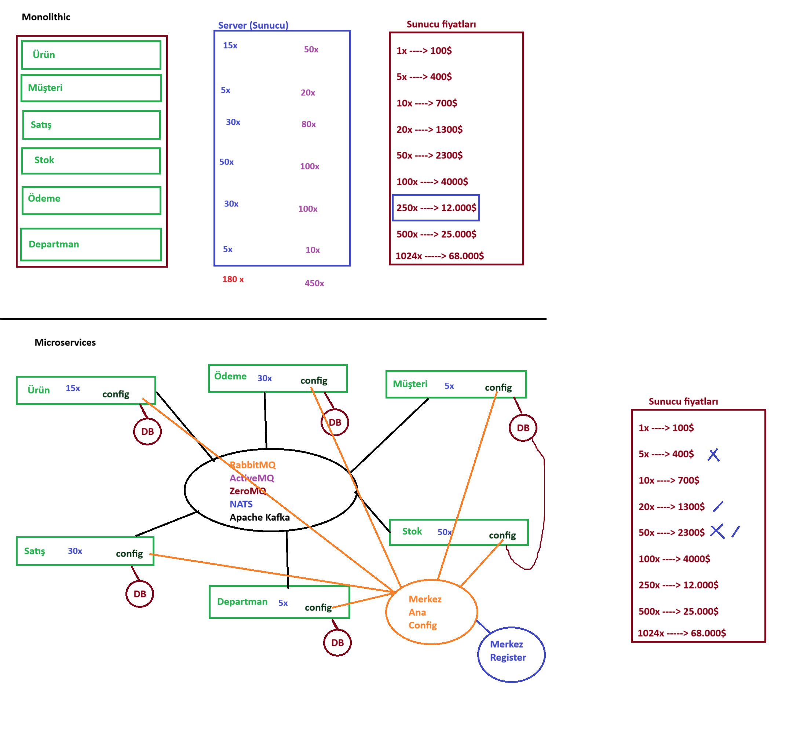

## Microservices - Docker

cd C:\Users\YOUR_USER_NAME\Documents\workspace\java-se-course\java-039-hello-docker

docker build  --build-arg  JAR_FILE=build/libs/java-039-hello-docker-1.0.0.jar -t  YOUR_DOCKER_USER_NAME/java-039-hello-docker:v001 .